# TikLive - Live Streaming Platform

## 📋 Mô tả dự án

TikLive là một ứng dụng livestream tương tự TikTok với đầy đủ tính năng social media hiện đại. Ứng dụng cho phép người dùng phát sóng trực tiếp, xem livestream, chat realtime, tương tác xã hội, và kiếm tiền thông qua hệ thống tặng quà. Ứng dụng sử dụng TencentRTC cho streaming, WebSocket cho chat realtime và VNPay sandbox để xử lý thanh toán.

## 📊 Use Case Diagram

```mermaid
graph TB
    %% Actors
    User((User<br/>Người dùng))
    Streamer((Streamer<br/>Người phát sóng))
    Admin((Admin<br/>Quản trị viên))
    
    %% Authentication & User Management
    subgraph "Authentication & User Management"
        UC1[Register<br/>Đăng ký]
        UC2[Login<br/>Đăng nhập]
        UC3[Update Profile<br/>Cập nhật hồ sơ]
        UC4[Reset Password<br/>Đặt lại mật khẩu]
        UC5[Verify Email<br/>Xác thực email]
    end
    
    %% Social Features
    subgraph "Social Features"
        UC6[Follow/Unfollow<br/>Theo dõi/Bỏ theo dõi]
        UC7[Create Post<br/>Tạo bài viết]
        UC8[Create Story<br/>Tạo story]
        UC9[Like Content<br/>Thích nội dung]
        UC10[Share Content<br/>Chia sẻ nội dung]
        UC11[Comment<br/>Bình luận]
        UC12[Reply Comment<br/>Trả lời bình luận]
    end
    
    %% Live Streaming
    subgraph "Live Streaming"
        UC13[View Live Stream<br/>Xem livestream]
        UC14[Create Live Stream<br/>Tạo livestream]
        UC15[Start Live Stream<br/>Bắt đầu phát sóng]
        UC16[End Live Stream<br/>Kết thúc phát sóng]
        UC17[Manage Stream Settings<br/>Quản lý cài đặt stream]
    end
    
    %% Real-time Chat
    subgraph "Real-time Chat"
        UC18[Send Chat Message<br/>Gửi tin nhắn chat]
        UC19[Join Chat Room<br/>Tham gia phòng chat]
        UC20[Private Message<br/>Tin nhắn riêng tư]
        UC21[React to Message<br/>Phản ứng tin nhắn]
        UC22[Delete Message<br/>Xóa tin nhắn]
    end
    
    %% Virtual Economy
    subgraph "Virtual Economy"
        UC23[Send Gift<br/>Tặng quà]
        UC24[Top-up Balance<br/>Nạp tiền]
        UC25[Withdraw Money<br/>Rút tiền]
        UC26[View Transaction History<br/>Xem lịch sử giao dịch]
        UC27[Manage Gifts<br/>Quản lý quà tặng]
    end
    
    %% Search & Discovery
    subgraph "Search & Discovery"
        UC28[Search Users<br/>Tìm kiếm người dùng]
        UC29[Search Content<br/>Tìm kiếm nội dung]
        UC30[Browse Trending<br/>Duyệt xu hướng]
        UC31[Get Recommendations<br/>Nhận gợi ý]
        UC32[Discover Content<br/>Khám phá nội dung]
    end
    
    %% Notifications
    subgraph "Notifications"
        UC33[Receive Notifications<br/>Nhận thông báo]
        UC34[Manage Notification Settings<br/>Quản lý cài đặt thông báo]
        UC35[Push Notifications<br/>Thông báo đẩy]
    end
    
    %% Reports & Moderation
    subgraph "Reports & Moderation"
        UC36[Report Content<br/>Báo cáo nội dung]
        UC37[Report User<br/>Báo cáo người dùng]
        UC38[Handle Reports<br/>Xử lý báo cáo]
        UC39[Ban/Unban User<br/>Cấm/Bỏ cấm người dùng]
        UC40[Moderate Content<br/>Kiểm duyệt nội dung]
    end
    
    %% Analytics & Management
    subgraph "Analytics & Management"
        UC41[View Analytics<br/>Xem thống kê]
        UC42[View Stream Analytics<br/>Xem thống kê stream]
        UC43[Manage Users<br/>Quản lý người dùng]
        UC44[System Management<br/>Quản lý hệ thống]
        UC45[Revenue Analytics<br/>Thống kê doanh thu]
    end
    
    %% User relationships
    User --> UC1
    User --> UC2
    User --> UC3
    User --> UC4
    User --> UC5
    User --> UC6
    User --> UC7
    User --> UC8
    User --> UC9
    User --> UC10
    User --> UC11
    User --> UC12
    User --> UC13
    User --> UC18
    User --> UC19
    User --> UC20
    User --> UC21
    User --> UC22
    User --> UC23
    User --> UC24
    User --> UC25
    User --> UC26
    User --> UC28
    User --> UC29
    User --> UC30
    User --> UC31
    User --> UC32
    User --> UC33
    User --> UC34
    User --> UC36
    User --> UC37
    
    %% Streamer relationships (inherits User + additional)
    Streamer --> UC1
    Streamer --> UC2
    Streamer --> UC3
    Streamer --> UC4
    Streamer --> UC5
    Streamer --> UC6
    Streamer --> UC7
    Streamer --> UC8
    Streamer --> UC9
    Streamer --> UC10
    Streamer --> UC11
    Streamer --> UC12
    Streamer --> UC13
    Streamer --> UC14
    Streamer --> UC15
    Streamer --> UC16
    Streamer --> UC17
    Streamer --> UC18
    Streamer --> UC19
    Streamer --> UC20
    Streamer --> UC21
    Streamer --> UC22
    Streamer --> UC23
    Streamer --> UC24
    Streamer --> UC25
    Streamer --> UC26
    Streamer --> UC27
    Streamer --> UC28
    Streamer --> UC29
    Streamer --> UC30
    Streamer --> UC31
    Streamer --> UC32
    Streamer --> UC33
    Streamer --> UC34
    Streamer --> UC36
    Streamer --> UC37
    Streamer --> UC41
    Streamer --> UC42
    Streamer --> UC45
    
    %% Admin relationships
    Admin --> UC2
    Admin --> UC38
    Admin --> UC39
    Admin --> UC40
    Admin --> UC41
    Admin --> UC43
    Admin --> UC44
    Admin --> UC45
    Admin --> UC27
    Admin --> UC35
    
    %% Styling
    classDef userClass fill:#e1f5fe,stroke:#0277bd,stroke-width:2px
    classDef streamerClass fill:#f3e5f5,stroke:#7b1fa2,stroke-width:2px
    classDef adminClass fill:#fff3e0,stroke:#ef6c00,stroke-width:2px
    classDef usecaseClass fill:#f1f8e9,stroke:#558b2f,stroke-width:1px
    
    class User userClass
    class Streamer streamerClass
    class Admin adminClass
```



### Use Case Descriptions

#### 👤 **User (Người dùng thường)**
- Đăng ký/đăng nhập tài khoản
- Xem livestream và tương tác (chat, tặng quà)
- Tạo và chia sẻ nội dung (posts, stories)
- Tương tác xã hội (follow, like, comment, share)
- Tìm kiếm và khám phá nội dung
- Quản lý thông báo và báo cáo vi phạm
- Quản lý ví và giao dịch

#### 🎥 **Streamer (Người phát sóng)**
- Tất cả quyền của User
- Tạo và quản lý livestream
- Phát sóng trực tiếp với các công cụ streaming
- Quản lý quà tặng và thu nhập
- Xem analytics cá nhân và stream
- Kiểm duyệt chat và tương tác trong stream

#### 🛡️ **Admin (Quản trị viên)**
- Quản lý người dùng và nội dung
- Xử lý báo cáo vi phạm
- Kiểm duyệt nội dung tự động và thủ công
- Cấm/bỏ cấm người dùng
- Quản lý hệ thống quà tặng
- Xem analytics tổng quan và doanh thu
- Quản lý cấu hình hệ thống

## 🏗️ Kiến trúc tổng quan

```
┌─────────────────┐    ┌─────────────────┐    ┌─────────────────┐
│  Flutter Client │◄──►│ SpringBoot API  │◄──►│   TencentRTC    │
└─────────────────┘    └─────────────────┘    └─────────────────┘
         │                       │                       
         │                       ▼                       
         │              ┌─────────────────┐              
         │              │     MySQL       │              
         │              └─────────────────┘              
         │                       │                       
         ▼                       ▼                       
┌─────────────────┐    ┌─────────────────┐              
│   WebSocket     │    │   Apache Kafka  │              
│  (Chat/Events)  │    │ (Message Queue) │              
└─────────────────┘    └─────────────────┘              
                                │                       
                                ▼                       
                       ┌─────────────────┐              
                       │      Redis      │              
                       │   (Cache/Store) │              
                       └─────────────────┘              
                                │                       
                                ▼                       
                       ┌─────────────────┐              
                       │   VNPay Gateway │              
                       └─────────────────┘              
```

## 🛠️ Tech Stack

### Backend (Spring Boot)
- **Framework**: Spring Boot 3.2+
- **Language**: Java 17+
- **Database**: MySQL 8.0+
- **ORM**: JPA/Hibernate
- **Security**: Spring Security + JWT
- **Streaming**: TencentRTC SDK
- **Real-time Communication**: WebSocket + STOMP
- **Payment**: VNPay API
- **Cache**: Redis
- **Message Queue**: Apache Kafka
- **Search**: Elasticsearch
- **File Storage**: AWS S3 / MinIO
- **Documentation**: Swagger/OpenAPI 3

### Frontend (Flutter)
- **Framework**: Flutter 3.16+
- **Language**: Dart 3+
- **State Management**: Bloc/Cubit
- **HTTP Client**: Dio
- **Real-time**: WebSocket + STOMP + TencentRTC
- **Local Storage**: Hive + SQLite
- **Push Notifications**: Firebase FCM
- **Analytics**: Firebase Analytics
- **Crash Reporting**: Firebase Crashlytics
- **Architecture**: Clean Architecture

## 🔥 Tính năng nổi bật

### 💬 Real-time Chat System
- **Multi-room Chat**: Hỗ trợ chat trong livestream, chat riêng tư, và chat nhóm
- **Message Types**: Text, emoji, GIF, sticker, voice messages
- **Typing Indicators**: Hiển thị khi người dùng đang gõ
- **Read Receipts**: Xác nhận tin nhắn đã đọc
- **Message Reactions**: React tin nhắn với emoji
- **Reply & Forward**: Trả lời và chuyển tiếp tin nhắn
- **Message Search**: Tìm kiếm trong lịch sử chat
- **Chat Moderation**: Auto-moderation với AI filter

### 🎥 Advanced Live Streaming
- **Multi-bitrate Streaming**: Adaptive streaming quality
- **Screen Sharing**: Chia sẻ màn hình trong livestream
- **Virtual Backgrounds**: Background ảo với AI
- **Beauty Filters**: Bộ lọc làm đẹp realtime
- **Interactive Elements**: Polls, Q&A, mini-games
- **Co-hosting**: Mời guests vào livestream
- **Stream Recording**: Tự động lưu livestream
- **Low Latency Mode**: Ultra-low latency cho gaming

### 📱 Social Features
- **Stories**: 24h stories với advanced editing
- **Posts**: Photo/video posts với rich editing
- **Reels**: Short-form videos tương tự TikTok
- **Live Shopping**: Tích hợp mua sắm trong livestream
- **Social Commerce**: Marketplace tích hợp
- **Influencer Tools**: Analytics và monetization tools
- **Community**: Tạo và quản lý communities
- **Events**: Tạo và tham gia events

### 🎁 Virtual Economy 2.0
- **Dynamic Pricing**: Giá gifts thay đổi theo demand
- **Limited Edition Gifts**: Gifts giới hạn theo sự kiện
- **Gift Combos**: Combo gifts với hiệu ứng đặc biệt
- **Subscription Model**: Monthly subscription cho premium features
- **Creator Fund**: Quỹ hỗ trợ creators
- **Revenue Sharing**: Chia sẻ doanh thu với creators
- **Virtual Currency**: Đa dạng loại tiền ảo
- **NFT Integration**: Tích hợp NFT marketplace

### 🤖 AI & Machine Learning
- **Content Recommendation**: AI recommend nội dung
- **Smart Moderation**: AI phát hiện nội dung vi phạm
- **Voice Enhancement**: AI cải thiện chất lượng âm thanh
- **Auto Subtitles**: Tự động tạo phụ đề
- **Sentiment Analysis**: Phân tích cảm xúc trong chat
- **Fraud Detection**: Phát hiện gian lận thanh toán
- **Personalization**: Cá nhân hóa trải nghiệm người dùng
- **Predictive Analytics**: Dự đoán xu hướng

### 🔐 Enterprise Security
- **End-to-End Encryption**: Mã hóa đầu cuối cho chat riêng tư
- **Two-Factor Authentication**: 2FA với SMS/Email/App
- **Biometric Authentication**: Face ID/Touch ID
- **Content Watermarking**: Watermark tự động cho livestream
- **DRM Protection**: Bảo vệ nội dung premium
- **Audit Logging**: Log đầy đủ các hoạt động
- **GDPR Compliance**: Tuân thủ quy định bảo mật dữ liệu
- **Content Backup**: Backup tự động nội dung quan trọng

## 🏛️ Clean Architecture

### Backend Architecture

```
src/
├── main/
│   ├── java/com/tiklive/
│   │   ├── TikLiveApplication.java
│   │   ├── config/                     # Configuration
│   │   │   ├── SecurityConfig.java
│   │   │   ├── DatabaseConfig.java
│   │   │   ├── RedisConfig.java
│   │   │   └── TencentConfig.java
│   │   ├── domain/                     # Domain Layer (Entities & Business Logic)
│   │   │   ├── entity/
│   │   │   │   ├── User.java
│   │   │   │   ├── LiveStream.java
│   │   │   │   ├── Gift.java
│   │   │   │   ├── Transaction.java
│   │   │   │   ├── Comment.java
│   │   │   │   ├── ChatMessage.java
│   │   │   │   ├── ChatRoom.java
│   │   │   │   ├── Notification.java
│   │   │   │   ├── Report.java
│   │   │   │   ├── Story.java
│   │   │   │   ├── Post.java
│   │   │   │   ├── Like.java
│   │   │   │   ├── Share.java
│   │   │   │   └── UserSession.java
│   │   │   ├── repository/             # Repository Interfaces
│   │   │   │   ├── UserRepository.java
│   │   │   │   ├── LiveStreamRepository.java
│   │   │   │   ├── TransactionRepository.java
│   │   │   │   ├── ChatMessageRepository.java
│   │   │   │   ├── NotificationRepository.java
│   │   │   │   ├── StoryRepository.java
│   │   │   │   └── PostRepository.java
│   │   │   └── service/                # Business Services
│   │   │       ├── UserService.java
│   │   │       ├── LiveStreamService.java
│   │   │       ├── PaymentService.java
│   │   │       ├── GiftService.java
│   │   │       ├── ChatService.java
│   │   │       ├── NotificationService.java
│   │   │       ├── StoryService.java
│   │   │       ├── PostService.java
│   │   │       ├── RecommendationService.java
│   │   │       └── ModerationService.java
│   │   ├── infrastructure/             # Infrastructure Layer
│   │   │   ├── repository/             # Repository Implementations
│   │   │   │   ├── JpaUserRepository.java
│   │   │   │   └── JpaLiveStreamRepository.java
│   │   │   ├── external/               # External Service Integrations
│   │   │   │   ├── tencent/
│   │   │   │   │   ├── TencentRTCService.java
│   │   │   │   │   └── TencentConfig.java
│   │   │   │   ├── vnpay/
│   │   │   │   │   ├── VNPayService.java
│   │   │   │   │   └── VNPayConfig.java
│   │   │   │   └── redis/
│   │   │   │       └── RedisService.java
│   │   │   └── messaging/              # Message Queue
│   │   │       ├── KafkaProducer.java
│   │   │       └── KafkaConsumer.java
│   │   ├── application/                # Application Layer
│   │   │   ├── dto/                    # Data Transfer Objects
│   │   │   │   ├── request/
│   │   │   │   │   ├── CreateLiveStreamRequest.java
│   │   │   │   │   ├── SendGiftRequest.java
│   │   │   │   │   └── TopUpRequest.java
│   │   │   │   └── response/
│   │   │   │       ├── UserResponse.java
│   │   │   │       ├── LiveStreamResponse.java
│   │   │   │       └── PaymentResponse.java
│   │   │   ├── usecase/                # Use Cases (Application Services)
│   │   │   │   ├── CreateLiveStreamUseCase.java
│   │   │   │   ├── SendGiftUseCase.java
│   │   │   │   ├── TopUpBalanceUseCase.java
│   │   │   │   └── JoinLiveStreamUseCase.java
│   │   │   └── mapper/                 # Entity-DTO Mappers
│   │   │       ├── UserMapper.java
│   │   │       └── LiveStreamMapper.java
│   │   └── presentation/               # Presentation Layer
│   │       ├── controller/             # REST Controllers
│   │       │   ├── AuthController.java
│   │       │   ├── UserController.java
│   │       │   ├── LiveStreamController.java
│   │       │   ├── PaymentController.java
│   │       │   ├── GiftController.java
│   │       │   ├── ChatController.java
│   │       │   ├── NotificationController.java
│   │       │   ├── StoryController.java
│   │       │   ├── PostController.java
│   │       │   ├── SearchController.java
│   │       │   └── AdminController.java
│   │       ├── websocket/              # WebSocket Handlers
│   │       │   ├── LiveStreamWebSocketHandler.java
│   │       │   ├── ChatWebSocketHandler.java
│   │       │   ├── NotificationWebSocketHandler.java
│   │       │   └── PresenceWebSocketHandler.java
│   │       ├── exception/              # Exception Handlers
│   │       │   ├── GlobalExceptionHandler.java
│   │       │   └── CustomExceptions.java
│   │       └── security/               # Security Components
│   │           ├── JwtAuthenticationFilter.java
│   │           ├── JwtTokenProvider.java
│   │           └── UserDetailsServiceImpl.java
│   └── resources/
│       ├── application.yml
│       ├── application-dev.yml
│       ├── application-prod.yml
│       └── db/migration/               # Flyway Migrations
│           ├── V1__Create_users_table.sql
│           ├── V2__Create_livestreams_table.sql
│           ├── V3__Create_gifts_table.sql
│           └── V4__Create_transactions_table.sql
```

### Frontend Architecture (Flutter)

```
lib/
├── main.dart
├── core/                               # Core Layer
│   ├── constants/
│   │   ├── api_constants.dart
│   │   ├── app_constants.dart
│   │   └── colors.dart
│   ├── error/
│   │   ├── exceptions.dart
│   │   └── failures.dart
│   ├── network/
│   │   ├── dio_client.dart
│   │   └── network_info.dart
│   ├── utils/
│   │   ├── formatters.dart
│   │   └── validators.dart
│   └── usecases/
│       └── usecase.dart
├── features/                           # Features (by domain)
│   ├── auth/
│   │   ├── data/
│   │   │   ├── datasources/
│   │   │   │   ├── auth_local_datasource.dart
│   │   │   │   └── auth_remote_datasource.dart
│   │   │   ├── models/
│   │   │   │   ├── user_model.dart
│   │   │   │   └── login_response_model.dart
│   │   │   └── repositories/
│   │   │       └── auth_repository_impl.dart
│   │   ├── domain/
│   │   │   ├── entities/
│   │   │   │   └── user.dart
│   │   │   ├── repositories/
│   │   │   │   └── auth_repository.dart
│   │   │   └── usecases/
│   │   │       ├── login_usecase.dart
│   │   │       ├── register_usecase.dart
│   │   │       └── logout_usecase.dart
│   │   └── presentation/
│   │       ├── bloc/
│   │       │   ├── auth_bloc.java
│   │       │   ├── auth_event.java
│   │       │   └── auth_state.java
│   │       ├── pages/
│   │       │   ├── login_page.dart
│   │       │   └── register_page.dart
│   │       └── widgets/
│   │           ├── login_form.dart
│   │           └── custom_text_field.dart
│   ├── livestream/
│   │   ├── data/
│   │   │   ├── datasources/
│   │   │   │   ├── livestream_remote_datasource.dart
│   │   │   │   └── tencent_rtc_datasource.dart
│   │   │   ├── models/
│   │   │   │   ├── livestream_model.dart
│   │   │   │   └── comment_model.dart
│   │   │   └── repositories/
│   │   │       └── livestream_repository_impl.dart
│   │   ├── domain/
│   │   │   ├── entities/
│   │   │   │   ├── livestream.dart
│   │   │   │   └── comment.dart
│   │   │   ├── repositories/
│   │   │   │   └── livestream_repository.dart
│   │   │   └── usecases/
│   │   │       ├── create_livestream_usecase.dart
│   │   │       ├── join_livestream_usecase.dart
│   │   │       └── send_comment_usecase.dart
│   │   └── presentation/
│   │       ├── bloc/
│   │       │   ├── livestream_bloc.java
│   │       │   ├── livestream_event.java
│   │       │   └── livestream_state.java
│   │       ├── pages/
│   │       │   ├── create_livestream_page.dart
│   │       │   ├── livestream_view_page.dart
│   │       │   └── livestream_list_page.dart
│   │       └── widgets/
│   │           ├── livestream_player.dart
│   │           ├── chat_widget.dart
│   │           └── viewer_count_widget.dart
│   ├── payment/
│   │   ├── data/
│   │   │   ├── datasources/
│   │   │   │   └── payment_remote_datasource.dart
│   │   │   ├── models/
│   │   │   │   ├── transaction_model.dart
│   │   │   │   └── gift_model.dart
│   │   │   └── repositories/
│   │   │       └── payment_repository_impl.dart
│   │   ├── domain/
│   │   │   ├── entities/
│   │   │   │   ├── transaction.dart
│   │   │   │   └── gift.dart
│   │   │   ├── repositories/
│   │   │   │   └── payment_repository.dart
│   │   │   └── usecases/
│   │   │       ├── topup_balance_usecase.dart
│   │   │       └── send_gift_usecase.dart
│   │   └── presentation/
│   │       ├── bloc/
│   │       │   ├── payment_bloc.java
│   │       │   ├── payment_event.java
│   │       │   └── payment_state.java
│   │       ├── pages/
│   │       │   ├── topup_page.dart
│   │       │   └── gift_shop_page.dart
│   │       └── widgets/
│   │           ├── gift_item_widget.dart
│   │           └── balance_widget.dart
│   └── profile/
│       ├── data/
│       ├── domain/
│       └── presentation/
└── injection_container.dart            # Dependency Injection
```

## 🗃️ Database Design

### ERD (Entity Relationship Diagram)

```mermaid
erDiagram
    USERS ||--o{ LIVE_STREAMS : creates
    USERS ||--o{ TRANSACTIONS : makes
    USERS ||--o{ COMMENTS : writes
    USERS ||--o{ GIFT_TRANSACTIONS : sends
    USERS ||--o{ GIFT_TRANSACTIONS : receives
    USERS ||--o{ CHAT_MESSAGES : sends
    USERS ||--o{ NOTIFICATIONS : receives
    USERS ||--o{ STORIES : creates
    USERS ||--o{ POSTS : creates
    USERS ||--o{ LIKES : gives
    USERS ||--o{ SHARES : makes
    USERS ||--o{ REPORTS : makes
    USERS ||--o{ USER_SESSIONS : has
    LIVE_STREAMS ||--o{ COMMENTS : contains
    LIVE_STREAMS ||--o{ GIFT_TRANSACTIONS : receives
    LIVE_STREAMS ||--o{ CHAT_ROOMS : has
    LIVE_STREAMS ||--o{ LIKES : receives
    LIVE_STREAMS ||--o{ SHARES : receives
    CHAT_ROOMS ||--o{ CHAT_MESSAGES : contains
    GIFTS ||--o{ GIFT_TRANSACTIONS : used_in
    POSTS ||--o{ LIKES : receives
    POSTS ||--o{ COMMENTS : receives
    STORIES ||--o{ LIKES : receives
    
    USERS {
        bigint id PK
        varchar username UK "INDEX"
        varchar email UK "INDEX"
        varchar password_hash
        varchar full_name
        varchar avatar_url
        text bio
        decimal balance "DEFAULT 0.00"
        boolean is_verified "DEFAULT false"
        boolean is_online "DEFAULT false"
        datetime last_seen
        json social_links
        enum status "active,inactive,banned"
        int followers_count "DEFAULT 0"
        int following_count "DEFAULT 0"
        datetime created_at "DEFAULT CURRENT_TIMESTAMP"
        datetime updated_at "DEFAULT CURRENT_TIMESTAMP ON UPDATE CURRENT_TIMESTAMP"
    }
    
    LIVE_STREAMS {
        bigint id PK
        bigint streamer_id FK
        varchar title
        text description
        varchar thumbnail_url
        varchar stream_key UK
        varchar tencent_room_id
        enum status "preparing,live,ended,cancelled"
        int viewer_count "DEFAULT 0"
        int like_count "DEFAULT 0"
        int share_count "DEFAULT 0"
        decimal total_gifts_value "DEFAULT 0.00"
        json stream_settings
        varchar category
        json tags
        boolean is_private "DEFAULT false"
        datetime started_at
        datetime ended_at
        datetime created_at "DEFAULT CURRENT_TIMESTAMP"
        datetime updated_at "DEFAULT CURRENT_TIMESTAMP ON UPDATE CURRENT_TIMESTAMP"
    }
    
    CHAT_ROOMS {
        bigint id PK
        bigint livestream_id FK
        varchar room_type "livestream,private,group"
        json settings
        boolean is_active "DEFAULT true"
        datetime created_at "DEFAULT CURRENT_TIMESTAMP"
    }
    
    CHAT_MESSAGES {
        bigint id PK
        bigint user_id FK
        bigint chat_room_id FK
        bigint parent_message_id FK "NULL"
        text content
        enum message_type "text,emoji,gif,sticker,system"
        json metadata
        boolean is_deleted "DEFAULT false"
        datetime created_at "DEFAULT CURRENT_TIMESTAMP"
    }
    
    COMMENTS {
        bigint id PK
        bigint user_id FK
        bigint livestream_id FK "NULL"
        bigint post_id FK "NULL"
        bigint story_id FK "NULL"
        bigint parent_comment_id FK "NULL"
        text content
        int like_count "DEFAULT 0"
        boolean is_pinned "DEFAULT false"
        datetime created_at "DEFAULT CURRENT_TIMESTAMP"
    }
    
    NOTIFICATIONS {
        bigint id PK
        bigint user_id FK
        bigint sender_id FK "NULL"
        varchar title
        text content
        enum type "like,comment,follow,gift,system,livestream"
        json data
        boolean is_read "DEFAULT false"
        datetime created_at "DEFAULT CURRENT_TIMESTAMP"
    }
    
    STORIES {
        bigint id PK
        bigint user_id FK
        varchar media_url
        varchar media_type "image,video"
        text caption
        json settings
        int view_count "DEFAULT 0"
        int like_count "DEFAULT 0"
        datetime expires_at
        datetime created_at "DEFAULT CURRENT_TIMESTAMP"
    }
    
    POSTS {
        bigint id PK
        bigint user_id FK
        text caption
        json media_urls
        varchar location
        json tags
        int like_count "DEFAULT 0"
        int comment_count "DEFAULT 0"
        int share_count "DEFAULT 0"
        boolean is_public "DEFAULT true"
        datetime created_at "DEFAULT CURRENT_TIMESTAMP"
        datetime updated_at "DEFAULT CURRENT_TIMESTAMP ON UPDATE CURRENT_TIMESTAMP"
    }
    
    LIKES {
        bigint id PK
        bigint user_id FK
        bigint livestream_id FK "NULL"
        bigint post_id FK "NULL"
        bigint story_id FK "NULL"
        bigint comment_id FK "NULL"
        datetime created_at "DEFAULT CURRENT_TIMESTAMP"
    }
    
    SHARES {
        bigint id PK
        bigint user_id FK
        bigint livestream_id FK "NULL"
        bigint post_id FK "NULL"
        varchar platform "internal,facebook,twitter,instagram"
        datetime created_at "DEFAULT CURRENT_TIMESTAMP"
    }
    
    REPORTS {
        bigint id PK
        bigint reporter_id FK
        bigint reported_user_id FK "NULL"
        bigint livestream_id FK "NULL"
        bigint post_id FK "NULL"
        bigint comment_id FK "NULL"
        enum reason "spam,harassment,inappropriate,copyright"
        text description
        enum status "pending,reviewed,resolved,dismissed"
        datetime created_at "DEFAULT CURRENT_TIMESTAMP"
    }
    
    USER_SESSIONS {
        bigint id PK
        bigint user_id FK
        varchar session_token UK
        varchar device_info
        varchar ip_address
        datetime last_activity
        boolean is_active "DEFAULT true"
        datetime created_at "DEFAULT CURRENT_TIMESTAMP"
    }
    
    GIFTS {
        bigint id PK
        varchar name
        varchar icon_url
        decimal price
        json animation_config
        varchar category
        int popularity_score "DEFAULT 0"
        boolean is_active "DEFAULT true"
        datetime created_at "DEFAULT CURRENT_TIMESTAMP"
        datetime updated_at "DEFAULT CURRENT_TIMESTAMP ON UPDATE CURRENT_TIMESTAMP"
    }
    
    GIFT_TRANSACTIONS {
        bigint id PK
        bigint sender_id FK
        bigint receiver_id FK
        bigint livestream_id FK
        bigint gift_id FK
        int quantity "DEFAULT 1"
        decimal total_amount
        json animation_data
        datetime created_at "DEFAULT CURRENT_TIMESTAMP"
    }
    
    TRANSACTIONS {
        bigint id PK
        bigint user_id FK
        varchar transaction_id UK
        enum type "topup,gift_purchase,gift_income,withdrawal,commission"
        decimal amount
        enum status "pending,completed,failed,cancelled"
        varchar payment_method
        varchar vnpay_transaction_id
        json metadata
        datetime created_at "DEFAULT CURRENT_TIMESTAMP"
        datetime updated_at "DEFAULT CURRENT_TIMESTAMP ON UPDATE CURRENT_TIMESTAMP"
    }
    
    FOLLOWERS {
        bigint id PK
        bigint follower_id FK
        bigint following_id FK
        datetime created_at "DEFAULT CURRENT_TIMESTAMP"
    }
```



### Database Schema

#### 1. Users Table
```sql
CREATE TABLE users (
    id BIGINT AUTO_INCREMENT PRIMARY KEY,
    username VARCHAR(50) UNIQUE NOT NULL,
    email VARCHAR(255) UNIQUE NOT NULL,
    password_hash VARCHAR(255) NOT NULL,
    full_name VARCHAR(100) NOT NULL,
    avatar_url TEXT,
    bio TEXT,
    balance DECIMAL(15,2) DEFAULT 0.00,
    is_verified BOOLEAN DEFAULT FALSE,
    is_online BOOLEAN DEFAULT FALSE,
    last_seen DATETIME,
    social_links JSON,
    status ENUM('active', 'inactive', 'banned') DEFAULT 'active',
    followers_count INT DEFAULT 0,
    following_count INT DEFAULT 0,
    created_at DATETIME DEFAULT CURRENT_TIMESTAMP,
    updated_at DATETIME DEFAULT CURRENT_TIMESTAMP ON UPDATE CURRENT_TIMESTAMP,
    
    INDEX idx_users_username (username),
    INDEX idx_users_email (email),
    INDEX idx_users_status (status),
    INDEX idx_users_is_online (is_online),
    INDEX idx_users_created_at (created_at)
);
```

#### 2. Live Streams Table
```sql
CREATE TABLE live_streams (
    id BIGINT AUTO_INCREMENT PRIMARY KEY,
    streamer_id BIGINT NOT NULL,
    title VARCHAR(255) NOT NULL,
    description TEXT,
    thumbnail_url TEXT,
    stream_key VARCHAR(255) UNIQUE NOT NULL,
    tencent_room_id VARCHAR(255),
    status ENUM('preparing', 'live', 'ended', 'cancelled') DEFAULT 'preparing',
    viewer_count INT DEFAULT 0,
    like_count INT DEFAULT 0,
    share_count INT DEFAULT 0,
    total_gifts_value DECIMAL(15,2) DEFAULT 0.00,
    stream_settings JSON,
    category VARCHAR(50),
    tags JSON,
    is_private BOOLEAN DEFAULT FALSE,
    started_at DATETIME,
    ended_at DATETIME,
    created_at DATETIME DEFAULT CURRENT_TIMESTAMP,
    updated_at DATETIME DEFAULT CURRENT_TIMESTAMP ON UPDATE CURRENT_TIMESTAMP,
    
    FOREIGN KEY (streamer_id) REFERENCES users(id) ON DELETE CASCADE,
    INDEX idx_livestreams_streamer_id (streamer_id),
    INDEX idx_livestreams_status (status),
    INDEX idx_livestreams_category (category),
    INDEX idx_livestreams_started_at (started_at),
    INDEX idx_livestreams_is_private (is_private)
);
```

#### 3. Chat Rooms Table
```sql
CREATE TABLE chat_rooms (
    id BIGINT AUTO_INCREMENT PRIMARY KEY,
    livestream_id BIGINT NOT NULL,
    room_type ENUM('livestream', 'private', 'group') DEFAULT 'livestream',
    settings JSON,
    is_active BOOLEAN DEFAULT TRUE,
    created_at DATETIME DEFAULT CURRENT_TIMESTAMP,
    
    FOREIGN KEY (livestream_id) REFERENCES live_streams(id) ON DELETE CASCADE,
    INDEX idx_chatrooms_livestream_id (livestream_id),
    INDEX idx_chatrooms_type (room_type)
);
```

#### 4. Chat Messages Table
```sql
CREATE TABLE chat_messages (
    id BIGINT AUTO_INCREMENT PRIMARY KEY,
    user_id BIGINT NOT NULL,
    chat_room_id BIGINT NOT NULL,
    parent_message_id BIGINT NULL,
    content TEXT NOT NULL,
    message_type ENUM('text', 'emoji', 'gif', 'sticker', 'system') DEFAULT 'text',
    metadata JSON,
    is_deleted BOOLEAN DEFAULT FALSE,
    created_at DATETIME DEFAULT CURRENT_TIMESTAMP,
    
    FOREIGN KEY (user_id) REFERENCES users(id) ON DELETE CASCADE,
    FOREIGN KEY (chat_room_id) REFERENCES chat_rooms(id) ON DELETE CASCADE,
    FOREIGN KEY (parent_message_id) REFERENCES chat_messages(id) ON DELETE SET NULL,
    INDEX idx_chat_messages_room_id (chat_room_id),
    INDEX idx_chat_messages_user_id (user_id),
    INDEX idx_chat_messages_created_at (created_at),
    INDEX idx_chat_messages_type (message_type)
);
```

#### 5. Comments Table
```sql
CREATE TABLE comments (
    id BIGINT AUTO_INCREMENT PRIMARY KEY,
    user_id BIGINT NOT NULL,
    livestream_id BIGINT NULL,
    post_id BIGINT NULL,
    story_id BIGINT NULL,
    parent_comment_id BIGINT NULL,
    content TEXT NOT NULL,
    like_count INT DEFAULT 0,
    is_pinned BOOLEAN DEFAULT FALSE,
    created_at DATETIME DEFAULT CURRENT_TIMESTAMP,
    
    FOREIGN KEY (user_id) REFERENCES users(id) ON DELETE CASCADE,
    FOREIGN KEY (livestream_id) REFERENCES live_streams(id) ON DELETE CASCADE,
    FOREIGN KEY (post_id) REFERENCES posts(id) ON DELETE CASCADE,
    FOREIGN KEY (story_id) REFERENCES stories(id) ON DELETE CASCADE,
    FOREIGN KEY (parent_comment_id) REFERENCES comments(id) ON DELETE CASCADE,
    INDEX idx_comments_livestream_id (livestream_id),
    INDEX idx_comments_post_id (post_id),
    INDEX idx_comments_user_id (user_id),
    INDEX idx_comments_created_at (created_at)
);
```

#### 6. Notifications Table
```sql
CREATE TABLE notifications (
    id BIGINT AUTO_INCREMENT PRIMARY KEY,
    user_id BIGINT NOT NULL,
    sender_id BIGINT NULL,
    title VARCHAR(255) NOT NULL,
    content TEXT,
    type ENUM('like', 'comment', 'follow', 'gift', 'system', 'livestream') NOT NULL,
    data JSON,
    is_read BOOLEAN DEFAULT FALSE,
    created_at DATETIME DEFAULT CURRENT_TIMESTAMP,
    
    FOREIGN KEY (user_id) REFERENCES users(id) ON DELETE CASCADE,
    FOREIGN KEY (sender_id) REFERENCES users(id) ON DELETE SET NULL,
    INDEX idx_notifications_user_id (user_id),
    INDEX idx_notifications_type (type),
    INDEX idx_notifications_is_read (is_read),
    INDEX idx_notifications_created_at (created_at)
);
```

#### 7. Stories Table
```sql
CREATE TABLE stories (
    id BIGINT AUTO_INCREMENT PRIMARY KEY,
    user_id BIGINT NOT NULL,
    media_url TEXT NOT NULL,
    media_type ENUM('image', 'video') NOT NULL,
    caption TEXT,
    settings JSON,
    view_count INT DEFAULT 0,
    like_count INT DEFAULT 0,
    expires_at DATETIME NOT NULL,
    created_at DATETIME DEFAULT CURRENT_TIMESTAMP,
    
    FOREIGN KEY (user_id) REFERENCES users(id) ON DELETE CASCADE,
    INDEX idx_stories_user_id (user_id),
    INDEX idx_stories_expires_at (expires_at),
    INDEX idx_stories_created_at (created_at)
);
```

#### 8. Posts Table
```sql
CREATE TABLE posts (
    id BIGINT AUTO_INCREMENT PRIMARY KEY,
    user_id BIGINT NOT NULL,
    caption TEXT,
    media_urls JSON,
    location VARCHAR(255),
    tags JSON,
    like_count INT DEFAULT 0,
    comment_count INT DEFAULT 0,
    share_count INT DEFAULT 0,
    is_public BOOLEAN DEFAULT TRUE,
    created_at DATETIME DEFAULT CURRENT_TIMESTAMP,
    updated_at DATETIME DEFAULT CURRENT_TIMESTAMP ON UPDATE CURRENT_TIMESTAMP,
    
    FOREIGN KEY (user_id) REFERENCES users(id) ON DELETE CASCADE,
    INDEX idx_posts_user_id (user_id),
    INDEX idx_posts_is_public (is_public),
    INDEX idx_posts_created_at (created_at)
);
```

#### 9. Likes Table
```sql
CREATE TABLE likes (
    id BIGINT AUTO_INCREMENT PRIMARY KEY,
    user_id BIGINT NOT NULL,
    livestream_id BIGINT NULL,
    post_id BIGINT NULL,
    story_id BIGINT NULL,
    comment_id BIGINT NULL,
    created_at DATETIME DEFAULT CURRENT_TIMESTAMP,
    
    FOREIGN KEY (user_id) REFERENCES users(id) ON DELETE CASCADE,
    FOREIGN KEY (livestream_id) REFERENCES live_streams(id) ON DELETE CASCADE,
    FOREIGN KEY (post_id) REFERENCES posts(id) ON DELETE CASCADE,
    FOREIGN KEY (story_id) REFERENCES stories(id) ON DELETE CASCADE,
    FOREIGN KEY (comment_id) REFERENCES comments(id) ON DELETE CASCADE,
    UNIQUE KEY unique_like_livestream (user_id, livestream_id),
    UNIQUE KEY unique_like_post (user_id, post_id),
    UNIQUE KEY unique_like_story (user_id, story_id),
    UNIQUE KEY unique_like_comment (user_id, comment_id),
    INDEX idx_likes_user_id (user_id),
    INDEX idx_likes_created_at (created_at)
);
```

#### 10. Shares Table
```sql
CREATE TABLE shares (
    id BIGINT AUTO_INCREMENT PRIMARY KEY,
    user_id BIGINT NOT NULL,
    livestream_id BIGINT NULL,
    post_id BIGINT NULL,
    platform ENUM('internal', 'facebook', 'twitter', 'instagram') DEFAULT 'internal',
    created_at DATETIME DEFAULT CURRENT_TIMESTAMP,
    
    FOREIGN KEY (user_id) REFERENCES users(id) ON DELETE CASCADE,
    FOREIGN KEY (livestream_id) REFERENCES live_streams(id) ON DELETE CASCADE,
    FOREIGN KEY (post_id) REFERENCES posts(id) ON DELETE CASCADE,
    INDEX idx_shares_user_id (user_id),
    INDEX idx_shares_platform (platform),
    INDEX idx_shares_created_at (created_at)
);
```

#### 11. Reports Table
```sql
CREATE TABLE reports (
    id BIGINT AUTO_INCREMENT PRIMARY KEY,
    reporter_id BIGINT NOT NULL,
    reported_user_id BIGINT NULL,
    livestream_id BIGINT NULL,
    post_id BIGINT NULL,
    comment_id BIGINT NULL,
    reason ENUM('spam', 'harassment', 'inappropriate', 'copyright') NOT NULL,
    description TEXT,
    status ENUM('pending', 'reviewed', 'resolved', 'dismissed') DEFAULT 'pending',
    created_at DATETIME DEFAULT CURRENT_TIMESTAMP,
    
    FOREIGN KEY (reporter_id) REFERENCES users(id) ON DELETE CASCADE,
    FOREIGN KEY (reported_user_id) REFERENCES users(id) ON DELETE CASCADE,
    FOREIGN KEY (livestream_id) REFERENCES live_streams(id) ON DELETE CASCADE,
    FOREIGN KEY (post_id) REFERENCES posts(id) ON DELETE CASCADE,
    FOREIGN KEY (comment_id) REFERENCES comments(id) ON DELETE CASCADE,
    INDEX idx_reports_reporter_id (reporter_id),
    INDEX idx_reports_status (status),
    INDEX idx_reports_reason (reason),
    INDEX idx_reports_created_at (created_at)
);
```

#### 12. User Sessions Table
```sql
CREATE TABLE user_sessions (
    id BIGINT AUTO_INCREMENT PRIMARY KEY,
    user_id BIGINT NOT NULL,
    session_token VARCHAR(255) UNIQUE NOT NULL,
    device_info JSON,
    ip_address VARCHAR(45),
    last_activity DATETIME,
    is_active BOOLEAN DEFAULT TRUE,
    created_at DATETIME DEFAULT CURRENT_TIMESTAMP,
    
    FOREIGN KEY (user_id) REFERENCES users(id) ON DELETE CASCADE,
    INDEX idx_sessions_user_id (user_id),
    INDEX idx_sessions_token (session_token),
    INDEX idx_sessions_is_active (is_active),
    INDEX idx_sessions_last_activity (last_activity)
);
```

#### 13. Gifts Table
```sql
CREATE TABLE gifts (
    id BIGINT AUTO_INCREMENT PRIMARY KEY,
    name VARCHAR(100) NOT NULL,
    icon_url TEXT NOT NULL,
    price DECIMAL(10,2) NOT NULL,
    animation_config JSON,
    category VARCHAR(50),
    popularity_score INT DEFAULT 0,
    is_active BOOLEAN DEFAULT TRUE,
    created_at DATETIME DEFAULT CURRENT_TIMESTAMP,
    updated_at DATETIME DEFAULT CURRENT_TIMESTAMP ON UPDATE CURRENT_TIMESTAMP,
    
    INDEX idx_gifts_is_active (is_active),
    INDEX idx_gifts_category (category),
    INDEX idx_gifts_price (price),
    INDEX idx_gifts_popularity (popularity_score)
);
```

#### 14. Gift Transactions Table
```sql
CREATE TABLE gift_transactions (
    id BIGINT AUTO_INCREMENT PRIMARY KEY,
    sender_id BIGINT NOT NULL,
    receiver_id BIGINT NOT NULL,
    livestream_id BIGINT NOT NULL,
    gift_id BIGINT NOT NULL,
    quantity INT DEFAULT 1,
    total_amount DECIMAL(15,2) NOT NULL,
    animation_data JSON,
    created_at DATETIME DEFAULT CURRENT_TIMESTAMP,
    
    FOREIGN KEY (sender_id) REFERENCES users(id) ON DELETE CASCADE,
    FOREIGN KEY (receiver_id) REFERENCES users(id) ON DELETE CASCADE,
    FOREIGN KEY (livestream_id) REFERENCES live_streams(id) ON DELETE CASCADE,
    FOREIGN KEY (gift_id) REFERENCES gifts(id) ON DELETE CASCADE,
    INDEX idx_gift_transactions_sender_id (sender_id),
    INDEX idx_gift_transactions_receiver_id (receiver_id),
    INDEX idx_gift_transactions_livestream_id (livestream_id),
    INDEX idx_gift_transactions_created_at (created_at)
);
```

#### 15. Transactions Table
```sql
CREATE TABLE transactions (
    id BIGINT AUTO_INCREMENT PRIMARY KEY,
    user_id BIGINT NOT NULL,
    transaction_id VARCHAR(255) UNIQUE NOT NULL,
    type ENUM('topup', 'gift_purchase', 'gift_income', 'withdrawal', 'commission') NOT NULL,
    amount DECIMAL(15,2) NOT NULL,
    status ENUM('pending', 'completed', 'failed', 'cancelled') DEFAULT 'pending',
    payment_method VARCHAR(50),
    vnpay_transaction_id VARCHAR(255),
    metadata JSON,
    created_at DATETIME DEFAULT CURRENT_TIMESTAMP,
    updated_at DATETIME DEFAULT CURRENT_TIMESTAMP ON UPDATE CURRENT_TIMESTAMP,
    
    FOREIGN KEY (user_id) REFERENCES users(id) ON DELETE CASCADE,
    INDEX idx_transactions_user_id (user_id),
    INDEX idx_transactions_type (type),
    INDEX idx_transactions_status (status),
    INDEX idx_transactions_created_at (created_at),
    INDEX idx_transactions_vnpay_id (vnpay_transaction_id)
);
```

#### 16. Followers Table
```sql
CREATE TABLE followers (
    id BIGINT AUTO_INCREMENT PRIMARY KEY,
    follower_id BIGINT NOT NULL,
    following_id BIGINT NOT NULL,
    created_at DATETIME DEFAULT CURRENT_TIMESTAMP,
    
    FOREIGN KEY (follower_id) REFERENCES users(id) ON DELETE CASCADE,
    FOREIGN KEY (following_id) REFERENCES users(id) ON DELETE CASCADE,
    UNIQUE KEY unique_follow (follower_id, following_id),
    INDEX idx_followers_follower_id (follower_id),
    INDEX idx_followers_following_id (following_id)
);
```

## 🚀 API Endpoints

### Authentication
```
POST   /api/v1/auth/register          # Đăng ký tài khoản
POST   /api/v1/auth/login             # Đăng nhập
POST   /api/v1/auth/logout            # Đăng xuất
POST   /api/v1/auth/refresh-token     # Làm mới token
POST   /api/v1/auth/forgot-password   # Quên mật khẩu
POST   /api/v1/auth/reset-password    # Đặt lại mật khẩu
POST   /api/v1/auth/verify-email      # Xác thực email
```

### User Management
```
GET    /api/v1/users/profile          # Lấy thông tin profile
PUT    /api/v1/users/profile          # Cập nhật profile
GET    /api/v1/users/{id}             # Lấy thông tin user khác
POST   /api/v1/users/{id}/follow      # Follow user
DELETE /api/v1/users/{id}/follow      # Unfollow user
GET    /api/v1/users/{id}/followers   # Danh sách followers
GET    /api/v1/users/{id}/following   # Danh sách following
GET    /api/v1/users/search           # Tìm kiếm user
PUT    /api/v1/users/privacy          # Cập nhật cài đặt riêng tư
GET    /api/v1/users/suggestions      # Gợi ý kết bạn
POST   /api/v1/users/block/{id}       # Chặn user
DELETE /api/v1/users/block/{id}       # Bỏ chặn user
```

### Live Stream
```
GET    /api/v1/livestreams            # Danh sách livestream đang live
POST   /api/v1/livestreams            # Tạo livestream mới
GET    /api/v1/livestreams/{id}       # Chi tiết livestream
PUT    /api/v1/livestreams/{id}       # Cập nhật livestream
DELETE /api/v1/livestreams/{id}       # Xóa livestream
POST   /api/v1/livestreams/{id}/start # Bắt đầu livestream
POST   /api/v1/livestreams/{id}/end   # Kết thúc livestream
POST   /api/v1/livestreams/{id}/join  # Tham gia xem livestream
POST   /api/v1/livestreams/{id}/like  # Like livestream
DELETE /api/v1/livestreams/{id}/like  # Unlike livestream
POST   /api/v1/livestreams/{id}/share # Share livestream
GET    /api/v1/livestreams/trending   # Livestream trending
GET    /api/v1/livestreams/category/{category} # Livestream theo category
GET    /api/v1/livestreams/following  # Livestream từ người đang follow
```

### Real-time Chat & Messaging
```
# WebSocket Endpoints
WS     /ws/chat/{roomId}              # Kết nối chat realtime
WS     /ws/livestream/{streamId}      # Kết nối livestream events
WS     /ws/notifications/{userId}     # Kết nối notifications realtime

# REST Endpoints
GET    /api/v1/chat/rooms             # Danh sách chat rooms
POST   /api/v1/chat/rooms             # Tạo chat room mới
GET    /api/v1/chat/rooms/{id}/messages # Lấy tin nhắn trong room
POST   /api/v1/chat/rooms/{id}/messages # Gửi tin nhắn
DELETE /api/v1/chat/messages/{id}     # Xóa tin nhắn
PUT    /api/v1/chat/messages/{id}     # Sửa tin nhắn
POST   /api/v1/chat/messages/{id}/react # React tin nhắn
GET    /api/v1/chat/direct/{userId}   # Chat trực tiếp với user
POST   /api/v1/chat/typing            # Gửi typing indicator
```

### Comments & Interactions
```
GET    /api/v1/livestreams/{id}/comments    # Lấy comments livestream
POST   /api/v1/livestreams/{id}/comments    # Gửi comment livestream
GET    /api/v1/posts/{id}/comments          # Lấy comments post
POST   /api/v1/posts/{id}/comments          # Gửi comment post
GET    /api/v1/stories/{id}/comments        # Lấy comments story
POST   /api/v1/stories/{id}/comments        # Gửi comment story
DELETE /api/v1/comments/{id}               # Xóa comment
PUT    /api/v1/comments/{id}               # Sửa comment
POST   /api/v1/comments/{id}/like          # Like comment
DELETE /api/v1/comments/{id}/like          # Unlike comment
POST   /api/v1/comments/{id}/reply         # Reply comment
POST   /api/v1/comments/{id}/pin           # Pin comment (chỉ streamer)
```

### Posts & Stories
```
GET    /api/v1/posts                  # Danh sách posts (timeline)
POST   /api/v1/posts                  # Tạo post mới
GET    /api/v1/posts/{id}             # Chi tiết post
PUT    /api/v1/posts/{id}             # Cập nhật post
DELETE /api/v1/posts/{id}             # Xóa post
POST   /api/v1/posts/{id}/like        # Like post
DELETE /api/v1/posts/{id}/like        # Unlike post
POST   /api/v1/posts/{id}/share       # Share post
GET    /api/v1/posts/trending         # Posts trending
GET    /api/v1/posts/user/{userId}    # Posts của user

GET    /api/v1/stories                # Danh sách stories
POST   /api/v1/stories                # Tạo story mới
GET    /api/v1/stories/{id}           # Chi tiết story
DELETE /api/v1/stories/{id}           # Xóa story
POST   /api/v1/stories/{id}/view      # Đánh dấu đã xem story
POST   /api/v1/stories/{id}/like      # Like story
GET    /api/v1/stories/user/{userId}  # Stories của user
```

### Gifts & Virtual Economy
```
GET    /api/v1/gifts                   # Danh sách gifts
GET    /api/v1/gifts/categories        # Categories của gifts
POST   /api/v1/gifts/send             # Tặng gift
GET    /api/v1/users/gifts/received   # Gifts đã nhận
GET    /api/v1/users/gifts/sent       # Gifts đã tặng
GET    /api/v1/gifts/leaderboard      # Leaderboard tặng gifts
GET    /api/v1/gifts/popular          # Gifts phổ biến
POST   /api/v1/gifts/combo            # Tặng combo gifts
```

### Payment & Wallet
```
GET    /api/v1/payments/balance        # Số dư tài khoản
POST   /api/v1/payments/topup         # Nạp tiền
POST   /api/v1/payments/withdraw       # Rút tiền
GET    /api/v1/payments/transactions  # Lịch sử giao dịch
GET    /api/v1/payments/statistics    # Thống kê thu chi
POST   /api/v1/payments/vnpay/callback # VNPay callback
GET    /api/v1/payments/methods       # Phương thức thanh toán
POST   /api/v1/payments/verify        # Xác thực giao dịch
```

### Notifications
```
GET    /api/v1/notifications          # Danh sách thông báo
PUT    /api/v1/notifications/{id}/read # Đánh dấu đã đọc
PUT    /api/v1/notifications/read-all # Đánh dấu tất cả đã đọc
DELETE /api/v1/notifications/{id}     # Xóa thông báo
GET    /api/v1/notifications/settings # Cài đặt thông báo
PUT    /api/v1/notifications/settings # Cập nhật cài đặt thông báo
POST   /api/v1/notifications/test     # Test push notification
```

### Search & Discovery
```
GET    /api/v1/search                 # Tìm kiếm tổng hợp
GET    /api/v1/search/users           # Tìm kiếm users
GET    /api/v1/search/livestreams     # Tìm kiếm livestreams
GET    /api/v1/search/posts           # Tìm kiếm posts
GET    /api/v1/search/hashtags        # Tìm kiếm hashtags
GET    /api/v1/search/suggestions     # Gợi ý tìm kiếm
GET    /api/v1/trending               # Nội dung trending
GET    /api/v1/discover               # Khám phá nội dung mới
```

### Reports & Moderation
```
POST   /api/v1/reports                # Báo cáo vi phạm
GET    /api/v1/reports                # Danh sách báo cáo (admin)
PUT    /api/v1/reports/{id}           # Xử lý báo cáo (admin)
POST   /api/v1/moderation/ban         # Ban user (admin)
POST   /api/v1/moderation/unban       # Unban user (admin)
GET    /api/v1/moderation/logs        # Logs moderation (admin)
```

### Analytics & Statistics
```
GET    /api/v1/analytics/dashboard    # Dashboard analytics
GET    /api/v1/analytics/livestream/{id} # Analytics livestream
GET    /api/v1/analytics/user         # Analytics cá nhân
GET    /api/v1/analytics/revenue      # Analytics doanh thu
GET    /api/v1/analytics/engagement   # Analytics tương tác
GET    /api/v1/analytics/audience     # Analytics audience
```

### Admin & Management
```
GET    /api/v1/admin/users            # Quản lý users
GET    /api/v1/admin/livestreams      # Quản lý livestreams
GET    /api/v1/admin/transactions     # Quản lý giao dịch
GET    /api/v1/admin/reports          # Quản lý báo cáo
GET    /api/v1/admin/system           # Thông tin hệ thống
POST   /api/v1/admin/announcements    # Tạo thông báo hệ thống
GET    /api/v1/admin/analytics        # Analytics tổng quan
```

## 💾 Cài đặt và Chạy dự án

### Prerequisites
- Java 17+
- Node.js 18+
- MySQL 8.0+
- Redis 6+
- Flutter 3.16+
- Docker & Docker Compose

### Backend Setup

1. **Clone repository**
```bash
git clone https://github.com/youruser/tiklive-backend.git
cd tiklive-backend
```

2. **Cấu hình Database**
```bash
# Tạo database
mysql -u root -p
CREATE DATABASE tiklive_dev CHARACTER SET utf8mb4 COLLATE utf8mb4_unicode_ci;
CREATE USER 'tiklive'@'localhost' IDENTIFIED BY 'your_password';
GRANT ALL PRIVILEGES ON tiklive_dev.* TO 'tiklive'@'localhost';
FLUSH PRIVILEGES;
EXIT;

# Chạy migrations
./mvnw flyway:migrate
```

3. **Cấu hình môi trường**
```yaml
# application-dev.yml
spring:
  datasource:
    url: jdbc:mysql://localhost:3306/tiklive_dev?useSSL=false&serverTimezone=UTC&allowPublicKeyRetrieval=true
    username: tiklive
    password: your_password
    driver-class-name: com.mysql.cj.jdbc.Driver
  
  jpa:
    hibernate:
      ddl-auto: validate
    show-sql: true
    properties:
      hibernate:
        dialect: org.hibernate.dialect.MySQL8Dialect
        format_sql: true
  
  redis:
    host: localhost
    port: 6379
    timeout: 2000ms
    lettuce:
      pool:
        max-active: 8
        max-idle: 8
        min-idle: 0
  
  kafka:
    bootstrap-servers: localhost:9092
    consumer:
      group-id: tiklive-group
      auto-offset-reset: earliest
    producer:
      key-serializer: org.apache.kafka.common.serialization.StringSerializer
      value-serializer: org.apache.kafka.common.serialization.StringSerializer
  
  websocket:
    allowed-origins: "*"
    endpoint: "/ws"
    app-destination-prefix: "/app"
    topic-prefix: "/topic"
    user-destination-prefix: "/user"

tencent:
  rtc:
    app-id: ${TENCENT_APP_ID:your_tencent_app_id}
    secret-key: ${TENCENT_SECRET_KEY:your_tencent_secret_key}
    expire-time: 86400
    
vnpay:
  sandbox:
    merchant-id: ${VNPAY_MERCHANT_ID:your_merchant_id}
    secret-key: ${VNPAY_SECRET_KEY:your_vnpay_secret}
    return-url: ${VNPAY_RETURN_URL:http://localhost:8080/api/v1/payments/vnpay/callback}
    notify-url: ${VNPAY_NOTIFY_URL:http://localhost:8080/api/v1/payments/vnpay/notify}

firebase:
  config:
    project-id: ${FIREBASE_PROJECT_ID:your_project_id}
    private-key: ${FIREBASE_PRIVATE_KEY:your_private_key}
    client-email: ${FIREBASE_CLIENT_EMAIL:your_client_email}

elasticsearch:
  host: localhost
  port: 9200
  scheme: http

minio:
  endpoint: http://localhost:9000
  access-key: ${MINIO_ACCESS_KEY:minioadmin}
  secret-key: ${MINIO_SECRET_KEY:minioadmin}
  bucket-name: tiklive-media

logging:
  level:
    com.tiklive: DEBUG
    org.springframework.web.socket: DEBUG
    org.hibernate.SQL: DEBUG
```

4. **Chạy ứng dụng**
```bash
./mvnw spring-boot:run
```

### Frontend Setup

1. **Clone repository**
```bash
git clone https://github.com/youruser/tiklive-flutter.git
cd tiklive-flutter
```

2. **Cài đặt dependencies**
```bash
flutter pub get
```

3. **Cấu hình môi trường**
```dart
// lib/core/constants/api_constants.dart
class ApiConstants {
  static const String baseUrl = 'http://localhost:8080/api/v1';
  static const String websocketUrl = 'ws://localhost:8080/ws';
  static const String tencentAppId = 'your_tencent_app_id';
}
```

4. **Chạy ứng dụng**
```bash
flutter run
```

### Docker Setup

```yaml
# docker-compose.yml
version: '3.8'
services:
  mysql:
    image: mysql:8.0
    environment:
      MYSQL_ROOT_PASSWORD: rootpassword
      MYSQL_DATABASE: tiklive_dev
      MYSQL_USER: tiklive
      MYSQL_PASSWORD: password
    ports:
      - "3306:3306"
    volumes:
      - mysql_data:/var/lib/mysql
      - ./docker/mysql/conf.d:/etc/mysql/conf.d
    command: --default-authentication-plugin=mysql_native_password
    networks:
      - tiklive-network

  redis:
    image: redis:6-alpine
    ports:
      - "6379:6379"
    command: redis-server --appendonly yes
    volumes:
      - redis_data:/data
    networks:
      - tiklive-network

  elasticsearch:
    image: docker.elastic.co/elasticsearch/elasticsearch:8.11.0
    environment:
      - discovery.type=single-node
      - xpack.security.enabled=false
      - ES_JAVA_OPTS=-Xms1g -Xmx1g
    ports:
      - "9200:9200"
    volumes:
      - es_data:/usr/share/elasticsearch/data
    networks:
      - tiklive-network

  kafka:
    image: confluentinc/cp-kafka:latest
    environment:
      KAFKA_ZOOKEEPER_CONNECT: zookeeper:2181
      KAFKA_ADVERTISED_LISTENERS: PLAINTEXT://localhost:9092
      KAFKA_OFFSETS_TOPIC_REPLICATION_FACTOR: 1
      KAFKA_AUTO_CREATE_TOPICS_ENABLE: true
    ports:
      - "9092:9092"
    depends_on:
      - zookeeper
    networks:
      - tiklive-network

  zookeeper:
    image: confluentinc/cp-zookeeper:latest
    environment:
      ZOOKEEPER_CLIENT_PORT: 2181
      ZOOKEEPER_TICK_TIME: 2000
    ports:
      - "2181:2181"
    networks:
      - tiklive-network

  minio:
    image: minio/minio:latest
    environment:
      MINIO_ROOT_USER: minioadmin
      MINIO_ROOT_PASSWORD: minioadmin
    ports:
      - "9000:9000"
      - "9001:9001"
    volumes:
      - minio_data:/data
    command: server /data --console-address ":9001"
    networks:
      - tiklive-network

  backend:
    build: ./backend
    ports:
      - "8080:8080"
    depends_on:
      - mysql
      - redis
      - kafka
      - elasticsearch
      - minio
    environment:
      - SPRING_PROFILES_ACTIVE=docker
      - DB_HOST=mysql
      - REDIS_HOST=redis
      - KAFKA_BOOTSTRAP_SERVERS=kafka:9092
      - ELASTICSEARCH_HOST=elasticsearch
      - MINIO_ENDPOINT=http://minio:9000
    networks:
      - tiklive-network

  nginx:
    image: nginx:alpine
    ports:
      - "80:80"
      - "443:443"
    volumes:
      - ./docker/nginx/nginx.conf:/etc/nginx/nginx.conf
      - ./docker/nginx/ssl:/etc/nginx/ssl
    depends_on:
      - backend
    networks:
      - tiklive-network

volumes:
  mysql_data:
  redis_data:
  es_data:
  minio_data:

networks:
  tiklive-network:
    driver: bridge
```

```bash
docker-compose up -d
```

## 🧪 Testing

### Backend Testing
```bash
# Unit tests
./mvnw test

# Integration tests
./mvnw test -Dtest=**/*IntegrationTest

# Test coverage
./mvnw jacoco:report
```

### Frontend Testing
```bash
# Unit tests
flutter test

# Widget tests
flutter test test/widget_test/

# Integration tests
flutter test integration_test/
```

## 📚 Development Guidelines

### Code Style
- **Backend**: Google Java Style Guide
- **Frontend**: Effective Dart Style Guide
- **Database**: Snake_case naming convention

### Git Workflow
```bash
# Feature branch
git checkout -b feature/livestream-chat
git commit -m "feat: implement real-time chat for livestream"

# Hotfix branch  
git checkout -b hotfix/payment-validation
git commit -m "fix: validate payment amount before processing"
```

### Commit Convention
```
feat: new feature
fix: bug fix
docs: documentation
style: formatting
refactor: code refactoring
test: adding tests
chore: maintenance
```

## 🚀 Deployment

### Production Environment
```yaml
# application-prod.yml
spring:
  datasource:
    url: ${DATABASE_URL}
    username: ${DB_USERNAME}
    password: ${DB_PASSWORD}
    
  redis:
    host: ${REDIS_HOST}
    port: ${REDIS_PORT}
    password: ${REDIS_PASSWORD}

server:
  port: ${PORT:8080}
  
logging:
  level:
    com.tiklive: INFO
    org.springframework.security: WARN
```

### CI/CD Pipeline (GitHub Actions)
```yaml
# .github/workflows/deploy.yml
name: Deploy to Production

on:
  push:
    branches: [main]

jobs:
  test:
    runs-on: ubuntu-latest
    steps:
      - uses: actions/checkout@v3
      - uses: actions/setup-java@v3
        with:
          java-version: '17'
      - run: ./mvnw test

  deploy:
    needs: test
    runs-on: ubuntu-latest
    steps:
      - uses: actions/checkout@v3
      - name: Deploy to Heroku
        uses: akhileshns/heroku-deploy@v3.12.12
        with:
          heroku_api_key: ${{secrets.HEROKU_API_KEY}}
          heroku_app_name: "tiklive-api"
          heroku_email: "your-email@example.com"
```

## 📊 Monitoring & Analytics

### Application Metrics
- **Micrometer + Prometheus**: Application metrics
- **ELK Stack**: Logging và monitoring
- **Sentry**: Error tracking
- **New Relic**: Performance monitoring

### Business Metrics
- **Daily Active Users (DAU)**
- **Monthly Active Users (MAU)**
- **Average Watch Time**
- **Gift Revenue per Stream**
- **User Retention Rate**

## 🔒 Security

### Backend Security
- **JWT Authentication** với refresh token
- **Rate limiting** cho API endpoints
- **Input validation** và sanitization
- **CORS** configuration
- **HTTPS** enforcement in production

### Data Protection
- **Password hashing** với BCrypt
- **Personal data encryption**
- **Database connection encryption**
- **API key management** với environment variables

## 🤝 Contributing

1. Fork the repository
2. Create a feature branch (`git checkout -b feature/amazing-feature`)
3. Commit your changes (`git commit -m 'Add some amazing feature'`)
4. Push to the branch (`git push origin feature/amazing-feature`)
5. Open a Pull Request

## 📄 License

This project is licensed under the MIT License - see the [LICENSE](LICENSE) file for details.

## 👥 Team

- **Backend Developer**: [Your Name]
- **Frontend Developer**: [Your Name]
- **DevOps Engineer**: [Your Name]
- **Product Manager**: [Your Name]

## 📞 Support

- **Email**: support@tiklive.com
- **Discord**: [TikLive Community](https://discord.gg/tiklive)
- **Documentation**: [docs.tiklive.com](https://docs.tiklive.com)

---

**Happy Streaming! 🎬✨**
